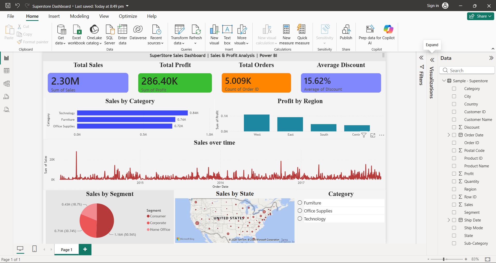

# 📊 Superstore Sales Dashboard (Power BI)

## 📌 Project Overview

This project presents an interactive Power BI dashboard built using the Superstore Sales dataset. The dashboard provides insights into sales performance, profit, customer segments, regional performance, and discount trends.

---

## 📂 Dataset

- Sample - Superstore.csv

---

## 🛠 Tools Used

- Microsoft Power BI
- CSV Dataset

---

## 📈 Dashboard Features

- Total Sales KPI
- Total Profit KPI
- Total Orders KPI
- Average Discount KPI
- Sales by Category
- Profit by Region
- Sales Over Time
- Sales by Segment
- Sales by State (Map)
- Category Slicer

---

## 📷 Dashboard Screenshot

---

## 📌 Key Insights

- Technology generated the highest sales.
- West region achieved the highest profit.
- Consumer segment contributed the largest share of sales.
- Sales fluctuated over time with noticeable peaks.
- Average discount across orders is approximately 16%.

---

## 👨‍💻 Author

Samarth Gangawane
